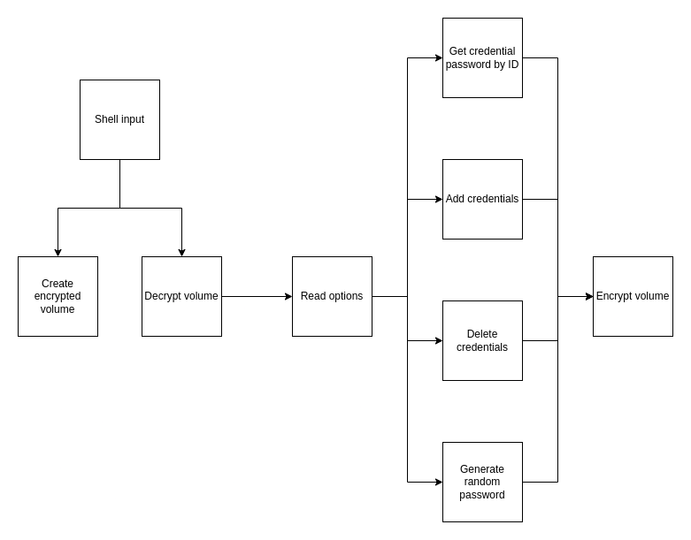

# Password Manager

This is a minimalist password manager written in Shell Script, using VeraCrypt to encrypt data.

## About the Project

This project was developed in **2 days** as part of a personal challenge: **creating a new project every weekend**. The goal is to develop skills I have been studying and solidify my learning.

## Diagram

This diagram provides an overview of the program, showing the step-by-step process.



## Features

- Generate random passwords
- Securely store credentials
- Access passwords without exposing them directly in the terminal
- Uses VeraCrypt for encryption
- All operations occur in RAM, ensuring security

## Requirements

- Linux/macOS
- VeraCrypt installed and executable in the terminal
- `xclip` to copy passwords to the clipboard
- Execution with sudo (due to VeraCrypt)

## Installation

1. Clone this repository:
   ```sh
   git clone https://github.com/your-username/password-manager.git
   cd password-manager
   ```

2. Grant execution permission to the script:
   ```sh
   chmod +x passwords.sh
   ```

## Usage

### Create the password volume (only once!!):
```sh
sudo ./passwords.sh --create-volume
```

### Add a credential:
```sh
sudo ./passwords.sh --add
```

### List credentials:
```sh
sudo ./passwords.sh --list
```

### Copy a password to the clipboard:
```sh
sudo ./passwords.sh --get-pass <ID>
```

### Generate a password and copy it to the clipboard:
```sh
sudo ./passwords.sh --generate-pass
```

### Remove a credential:
```sh
sudo ./passwords.sh --remove <ID>
```

## Security

- The password file is stored inside a VeraCrypt-encrypted volume.
- The password is never displayed in the terminal.
- All processing occurs in RAM, preventing sensitive data from being written to disk.
- The volume is automatically unmounted when the script execution ends.

## Improvements

- Automatically create the volume if it does not exist, removing the need for --create-volume
- Input validation for adding credentials
- Create a configuration file

## Reference Books

- Professional Shell Script - Aurelio Marinho. Novatec Editora. 2008.
- Efficient Linux Command Line - Daniel J. Barrett. Novatec Editora. 2022.

## Contribution

If you'd like to suggest improvements or report issues, feel free to open an issue or submit a pull request.

## License

This project is licensed under the MIT License.

